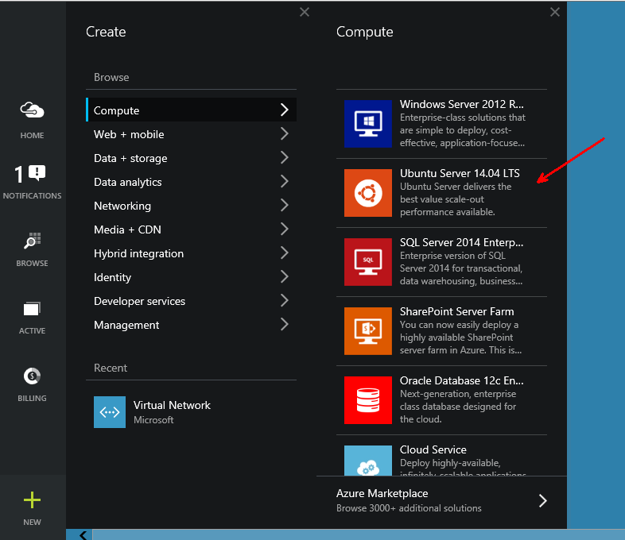
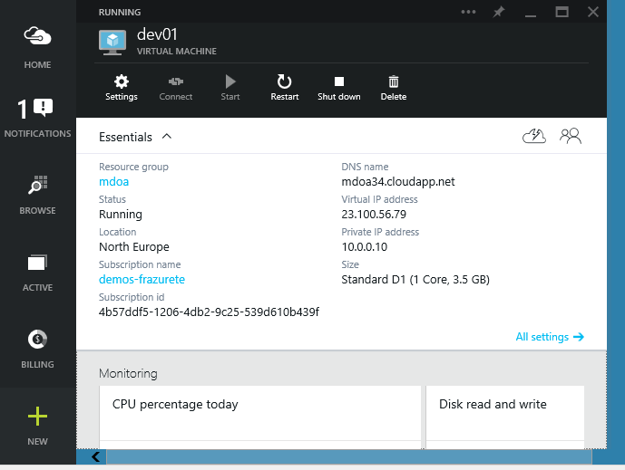
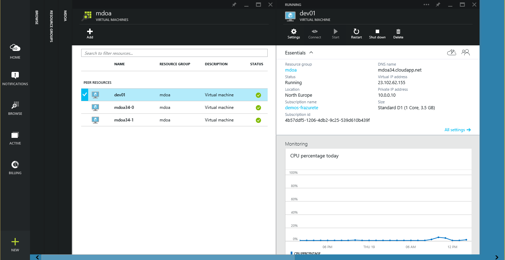
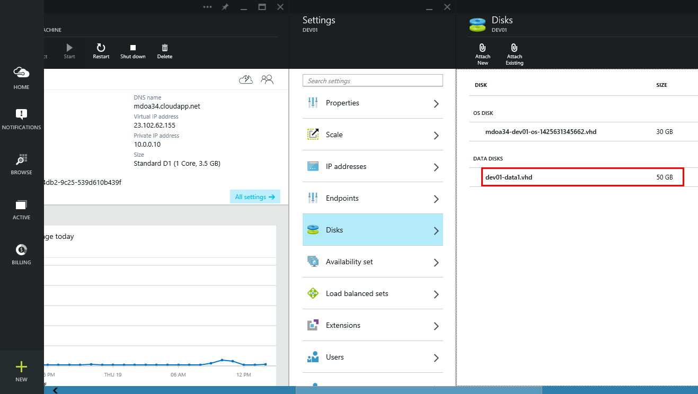
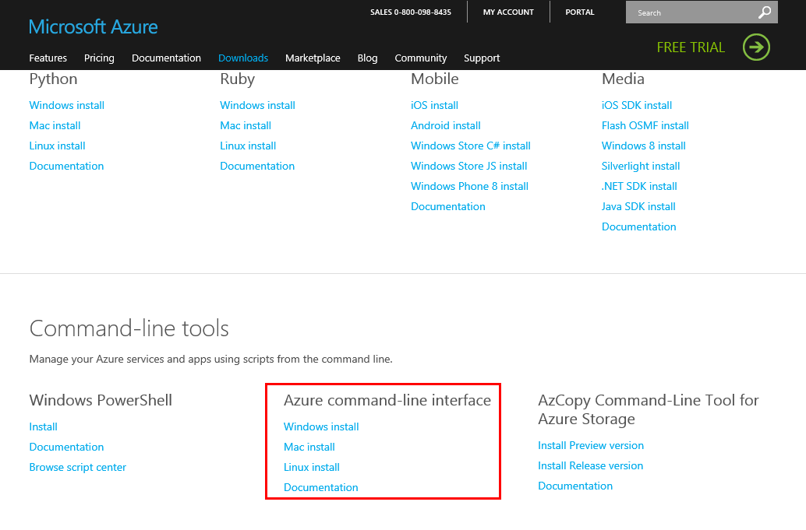
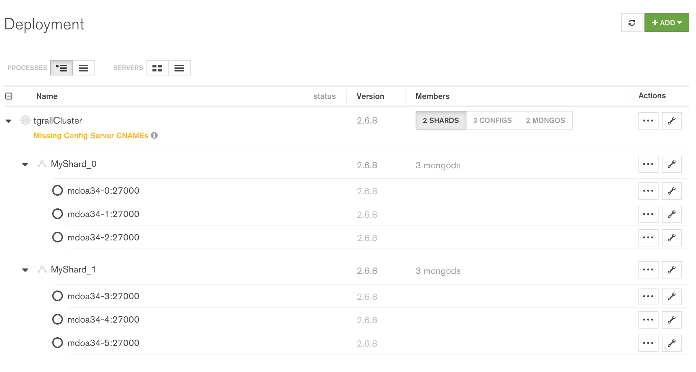

#MongoDB on Azure

Authors:

* [Benjamin Guinebertière](http://twitter.com/benjguin)
* [Tugdual Grall](http://twitter.com/tgrall)

## Introduction

This workshop is a good opportunity to get your hands dirty using MongoDB on Microsoft Azure.

The main steps for this workshop are:

* Register to Microsoft Azure
* Register to MongoDB Management Services (MMS)
* Create Single Linux VM on Azure
* Deploy Single MongoDB instance on Azure
* Deploy new Virtual Machines
* Deploy Scalable and Reliable MongoDB Cluster 


## Convention

The prefix used for this environment is `mdoa`, standing for **M**ongo**D**B **o** **A**zure 

Some names have `34` in them. This is a random number that will be chosen differently by each attendee. For instance, mdoa34a for instructors will be replaced by mdoa0123a by one person, mdoa12a by another one and so on.

## Get an Azure subscription

cf [[TUTO] Comment disposer d’un abonnement Microsoft Azure ?](http://blogs.microsoft.fr/azure/tuto-comment-disposer-dun-abonnement-microsoft-azure.html)

unless stated otherwise, the rest of the document will use the azure portal at http://portal.azure.com
cf [les portails Azure](http://blogs.microsoft.fr/azure/tuto-les-portails-azure-pourquoi-un-nouveau-portail.html) for additional information.

## Get an MMS Account

MMS is a cloud service that makes it easy for you to provision, monitor, backup and scale MongoDB on the infrastructure of your choice.

This is the easiest way to run MongoDB, it helps you to deploy, monitor and backup your MongoDB instances.

In this workshop we will use MMS to:

* Deploy MongoDB
* Monitor your instance
* Upgrade your cluster to the latest release.

You need first to create an account here:

* [http://mms.mongodb.com](http://mms.mongodb.com)

The user profile steps are:

1. Enter your name, email and role
2. Enter your address
3. Create a new group (enter for example [yourname]-azure-workshop)
4. Welcome Message 

We will continue with MMS later in this workshop.

##prepare your local machine

You'll need an HTML5 browser to access Azure portals.

On Windows, we'll use a bash command line prompt to generate keys and access to the VMs thru ssh. This documentation as been tested with the one provided by the [git client](http://www.git-scm.com/downloads).

## Generate keys to access your Virtual Machines

We will be using SSH keys to connect to the different VM created in this Workshop. Use the following commands to create SSH keys:

```
ssh-keygen -t rsa -C "your_email@example.com"
```

Enter **`mdoa`** for the file name and do not set any passphrase. This will create 2 files:

* `mdoa` : identification/private key
* `mdoa.pub` : public key

Create a Certificate that will be used to create new VMs from the Azure CLI (Command Line Interface):

On MAC or Linux:

```
openssl req -x509 -days 365 -new -key mdoa -out mdoa.pem
```

On Windows:
```
openssl req -config /usr/ssl/openssl.cnf -x509 -days 365 -new -key mdoa -out mdoa.pem
```

Entered the following (exemple):
```
Country Name (2 letter code) [AU]:FR
State or Province Name (full name) [Some-State]:France
Locality Name (eg, city) []:Paris
Organization Name (eg, company) [Internet Widgits Pty Ltd]:mdoa
Organizational Unit Name (eg, section) []:mdoa
Common Name (eg, YOUR name) []:mdoa
Email Address []:your_email@example.com
```

You shoud now have the following files: 

- a private key file: mdoa
- a public key file: mdoa.pub
- a certificate file: mdoa.pem

##create the first VM, with network, and storage

We'll create a first VM named dev01

Go to the [http://portal.azure.com](http://portal.azure.com)



Fill in the Wizzard

- Create VM
	- Host Name: dev01
	- User Name: mdoa
	- Authentication Type: SSH Public Key
	- SSH Public Key: *copy and paste the content of the file mdoa.pub*
	- Pricing Tier: Standard D1 *(you may have to click on View All)*
	- Network, storage, diagnostics
		- Availability set: *leave: Not Configured, Not part of an availability set, Standalone virtual machine*
		- network
			- Virtual Network
				- Create new Virtual Network
					- Name: mdoa
					- Adress Space CIDR Block: 10.0.0.0/16
					- Primary DNS Server: *leave blank*
					- Secondary DNS Server: *leave blank*
			- Subnet-1: *cannot change, keep 10.0.0.0/24*
			- Domaine Name: *keep dev01-xyz.cloudapp.net which is unique or choose another unique name. Instructors use mdoa34.cloudapp.net*
			- Ip addresses
				- Static IP address assignment: Static
				- Static IP address: 10.0.0.10
		- Storage account
			- Storage: *keep dev01xyz which is unique or choose another unique name. Instructors use mdoa34*
			- pricing tier: Standard-LRS
	- Resource Group: 
		- create a new resource group
			- Name: mdoa
	- Subscription: *keep the default, or choose the one you want if you have several subscriptions*
	- Location: North Europe

Click on "Create"

this generates the following result:




You can then connect thru:

```
ssh -i mdoa mdoa@mdoa34.cloudapp.net 
```

sample result for the first connection:

```
$ ssh -i mdoa mdoa@mdoa34.cloudapp.net
The authenticity of host 'mdoa34.cloudapp.net (23.100.56.79)' can't be established.
ECDSA key fingerprint is fd:5c:e1:4f:be:79:6f:4e:7a:09:ea:1c:42:d7:f8:fe.
Are you sure you want to continue connecting (yes/no)? yes
Warning: Permanently added 'mdoa34.cloudapp.net,23.100.56.79' (ECDSA) to the list of known hosts.
Welcome to Ubuntu 14.04.1 LTS (GNU/Linux 3.16.0-29-generic x86_64)

 * Documentation:  https://help.ubuntu.com/

  System information as of Fri Mar  6 08:44:43 UTC 2015

  System load: 0.55              Memory usage: 2%   Processes:       206
  Usage of /:  32.3% of 1.94GB   Swap usage:   0%   Users logged in: 0

  Graph this data and manage this system at:
    https://landscape.canonical.com/

  Get cloud support with Ubuntu Advantage Cloud Guest:
    http://www.ubuntu.com/business/services/cloud

1 package can be updated.
1 update is a security update.


The programs included with the Ubuntu system are free software;
the exact distribution terms for each program are described in the
individual files in /usr/share/doc/*/copyright.

Ubuntu comes with ABSOLUTELY NO WARRANTY, to the extent permitted by
applicable law.
```

##add a data disk to the dev01 vm

As we want to have data on a disk separate from the OS disk, we'll add a data disk.

In the [Azure portal](portal.azure.com), find the dev01 VM. For instance, go to browse, resource groups, mdoa, Virtual Machines, and click on dev01.



Then add the disk: 

- click on settings
	- click on *Disks*
		- click on *Attach New*
			- Storage Container
				- Choose Storage Account
					- mdoa34
					- Choose container
						- vhds
			- Disk File Name: dev01-data1.vhd
			- Size: 50 GB
			- Host Caching: None

You should now see the new empty disk attached:



Connect into the dev01 VM thru ssh an do the following: 

```
sudo fdisk /dev/sdc
n
p
1
<RETURN>
<RETURN>
p
w
sudo sfdisk -d /dev/sdc > ~/dev_sdc_config
sudo mkfs -t ext4 /dev/sdc1
sudo mkdir -p /data
sudo mount /dev/sdc1 /data
sudo sed -i '$a/dev/sdc1 /data ext4 defaults 1 2' /etc/fstab
```

##install software on dev01

###Apply updates

```
sudo apt-get update
sudo apt-get dist-upgrade
sudo unattended-upgrade
```

###Connect to the azure subscription

For that we need the Azure Command Line Interface (Azure CLI / Azure xplat-cli). One can find documentation and the location where to download it at http://azure.microsoft.com/en-us/downloads/



Additional information on its usage can be found here. The document contains information on how to apt-get the tool.
http://azure.microsoft.com/en-us/documentation/articles/xplat-cli/

from dev01, run the following commands: 

```
sudo apt-get install nodejs-legacy
sudo apt-get install npm
sudo npm install -g azure-cli
```

if you enter 

```
azure
```

you should get this: 

```
mdoa@dev01:~$ azure
info:             _    _____   _ ___ ___
info:            /_\  |_  / | | | _ \ __|
info:      _ ___/ _ \__/ /| |_| |   / _|___ _ _
info:    (___  /_/ \_\/___|\___/|_|_\___| _____)
info:       (_______ _ _)         _ ______ _)_ _
info:              (______________ _ )   (___ _ _)
info:
info:    Microsoft Azure: Microsoft's Cloud Platform
info:
info:    Tool version 0.8.15
help:
help:    Display help for a given command
help:      help [options] [command]
help:
help:    Log in to an Azure subscription using Active Directory. Currently, the user can login only via Microsoft organizational account
help:      login [options]
help:
help:    Log out from Azure subscription using Active Directory. Currently, the user can log out only via Microsoft organizational account
help:      logout [options] [username]
help:
help:    Open the portal in a browser
help:      portal [options]
help:
help:    Commands:
help:      account        Commands to manage your account information and publish settings
help:      config         Commands to manage your local settings
help:      hdinsight      Commands to manage your HDInsight accounts
help:      mobile         Commands to manage your Mobile Services
help:      network        Commands to manage your Networks
help:      sb             Commands to manage your Service Bus configuration
help:      service        Commands to manage your Cloud Services
help:      site           Commands to manage your Web Sites
help:      sql            Commands to manage your SQL Server accounts
help:      storage        Commands to manage your Storage objects
help:      vm             Commands to manage your Virtual Machines
help:
help:    Options:
help:      -h, --help     output usage information
help:      -v, --version  output the application version
mdoa@dev01:~$
```

Connect to the subscription by downloading a publishsettings file and importing it. You just have to do that once. 

Open a browser to [http://go.microsoft.com/fwlink/?LinkId=254432](http://go.microsoft.com/fwlink/?LinkId=254432) and save the file as mdoa_azure_subscription.publishsettings (for instance).

NB: this file contaazure vm list
ins a private key to access all your Azure subscription. **Keep it in a safe place.** 

copy the file to dev01. From your laptop
```
scp -i mdoa mdoa_azure_subscription.publishsettings mdoa@mdoa34.cloudapp.net:/home/mdoa
```

```
azure account import mdoa_azure_subscription.publishsettings
```

then you can test you have access to the subscription:

```
azure vm list
info:    Executing command vm list
+ Getting virtual machines
data:    Name   Status     Location      DNS Name             IP Address
data:    -----  ---------  ------------  -------------------  ----------
data:    dev01  ReadyRole  North Europe  mdoa34.cloudapp.net  10.0.0.10
info:    vm list command OK
```

once this is done you can remove the publishsettings file itself.

```
rm mdoa_azure_subscription.publishsettings
```

### Install a local MongoDB instance

Now that we have one Linux VM running on Microsoft Azure we can now install MongoDB.

In this first step, let's start by installing a simple MongoDB node manually. (later you will use MongoDB Management Service http://mms.mongodb.com to deploy and manager a bigger cluster.)

For this let's simply the steps described in this tutorial:

* [Install MongoDB on Ubuntu](http://docs.mongodb.org/manual/tutorial/install-mongodb-on-ubuntu/)

You have deployed a single node MongoDB on your main Azure Virtual Machine.

Let's update the MongoDB configuration to allow client connection in azure environmentthe :

```
sudo vi /etc/mongod.conf
```

Remove the space in the bind_id line, to have something like (see [SERVER-17733](https://jira.mongodb.org/browse/SERVER-17733)):

```
bind_id=127.0.0.1
```


Restart MongoDB using 

```
sudo service mongod restart
```


As you can see you can connect to the instance and create data:

```
mongo 

use mydb

db.persons.insert({ "name" : "John Doe" , "age" : 45 });

db.persons.find();

```

It is possible to deploy manually a more reliable MongoDB Instance using a "[Replica Set](http://docs.mongodb.org/manual/replication/)" or scale it out using "[Sharding](http://docs.mongodb.org/manual/sharding/)".

One of the benefits of deploying MongoDB on Microsoft Azure is the fact that you can use automation to achieve this. Let's do it.

###Deploy the rest of the infrastructure

#### Introduction

You will now deploy a sharded MongoDB cluster on multiple machines, the main steps will be :

* Create new Virtual Machines using scripts
* Deploy MongoDB Automation Agent using scripts
* Deploy MongoDB Cluster using MMS (MongoDB Management Services)
* Use MongoDB Instance
* Change MongoDB configuration using MMS

We have mentionned earlier that MMS will be used to deploy the MongoDB cluster. This is how it is working:

* You must install the MongoDB Automation Agent on any machine where you will eventually run a MongoDB process (mongod, configserver, mongos)
* This agent will be used by MMS to send order and orchestrate any management operation such as : deploy/install new nodes, start/stop process, upgrade infrastructure, .... It is also possible to install the MMS Backup and Monitoring Agents.

In this workshop we have scripted the installation of the MongoDB Automation Agent on all nodes, this will allow you to install new MongoDB nodes as you need it.

#### Create & Configure new Virtual Machines

The first thing to do is to find your MMS Group ID and API Keys. You will find this information in MMS application:

* If you are still on the welcome page, click on "Advanced Settings"
* Ckick on "Administration" in the left menu
* Click on "Group Settings"
* The Group ID and API Keys are available at the top of the page

Let's now prepare the scripts and copy them to the main VM (`dev01`).

*From your laptop:*

1- In mdoa-config-automation.sh replace `__XYZ__` with your own MMS Group Id and API Key

2- Copy all the keys and shell scripts to your main VM

```
scp -i mdoa mdoa.pem mdoa@mdoa34.cloudapp.net:/home/mdoa
scp -i mdoa mdoa mdoa@mdoa34.cloudapp.net:/home/mdoa
scp -i mdoa *.sh mdoa@mdoa34.cloudapp.net:/home/mdoa
```


*From dev01:*

Now that we have uploaded all the files to `dev01`, we should create the new vms, and configure them using the following steps:

```
chmod 600 mdoa
chmod +x *.sh
./azure_create_vms.sh
./azure_configure_vms.sh
```

Answer yes to questions like 
```
The authenticity of host '10.0.0.101 (10.0.0.101)' can't be established.
ECDSA key fingerprint is 52:8a:0d:ba:e6:e3:fd:08:86:2a:55:1f:e7:05:8e:09.
Are you sure you want to continue connecting (yes/no)?
...
```

At the end of these steps you should have:

* 8 new VMs called mdoa34-0 .... mdoa34-7, with IP addresses from 10.0.0.100 to 10.0.0.107
* Each of them have the MMS Aggent installed anc configured

You should be able to see them in the MMS console:

1. Click on "Administration"
2. Click on "Agents"

You should see all the automation agents deployed in all your VMS.

### Deploy a new MongoDB Cluster

Now that we have all the machines with the MMS Automation Agent install on each of them, we can deploy a cluster.

**What's a MongoDB Cluster?**

If you are not familiar with MongoDB architecture, here a quick overview.

For **high availability**, MongoDB uses the concept of "Replica Set". A replica set is a group of mongod instances that host the same data set. One mongod, the primary, receives all write operations. All other instances, secondaries, apply operations from the primary so that they have the same data set.

For **horizontal scalability** (scaling out), MongoDB uses the concept of Sharding. In MongoDB each shard is a replica set.

So in our case we will use 2 shards, so we will build a cluster made of 2 replica set (one in each shard)

In addition to the replica set, MongoDB cluster needs 3 configs servers used to store shards information, and 1 or more Routers (mongos)

So the global architecture of a Sharded cluster looks like:


MMS allows you to deploy such configuration easily using simple wizards.

#### Deploy the cluster

You can find more informations in the [MMS Documentation](https://docs.mms.mongodb.com/tutorial/deploy-sharded-cluster/)

1- Select the Deployment tab and then the Deployment page.

2- Click the Add button and select Create New Cluster.

3- Configure the sharded cluster. 

*Global Informations*

* Name : [yourName]Cluster  *(eg jdoeCluster)*
* Version : 2.6.8  *(we will upgrade it to 3.0.x)*
* Eliglble Server : mdoa34  *(all server starting with...)*
* Data Node Ports : from 27000  to 28000

*Mongos (routers) configuration*

* nb of Mongos : 2, port 27017
* Mongos Distribution : On a Data Node

*Config Server configuration*

* Port : 27019
* Distribution : On a Data Node


*Shard Configuration*

* Shard Count : 2
* MongoDs per shard : 3
* Shard Name Prefix : MyShard
* DBPath prefix : /data


4- Click Apply

Nothing happen so far, you have just created a deployment plan.

You can use the "Severs" view to move the processes on different machines, for example to better use the Azure Availability Set feature, or to configure each process individually.

You can apply any modification until you click the "Review and Deploy" button.

Note: You can ignore the "Missing CNAME" warning for the workshop. This is a check made by MongoDB, since CNAME will help to move config server on various hosts once deployed; something that could happen in a production environment

5- Click Review and Deploy

You can review the full configuration, for example see the various machines used by the cluster.

While deploying to a production environment you will push some of the process to multiple data center (availability zone) to ensure the availability of your database.

6- Click Confirm & Deploy

Now MMS will use the various agent to donwload MongoDB and create the cluster based on the information you have provided in the deployment plan.


#### Your MongoDB Cluser on Azure

You have now a 2 shard cluster running on Microsoft Azure, that looks like:



You can click on the various types of nodes **Shards | Configs | Mongos**

Let's for example click on the Mongos, since they are the nodes you will be using when you connect to the cluster from the MongoDB Shell or from any application.


### USe MongoDB


##### Connect to MongoDB

From your dev01 machine, where you have manually installed MongoDB, connect to your Cluster using the shell:

```
mongo 10.0.0.104

sh.status()

```

The `sh.status()` will show you the status of the cluster, you should see something like

```
mongos> sh.status()
--- Sharding Status --- 
  sharding version: {
	"_id" : 1,
	"version" : 4,
	"minCompatibleVersion" : 4,
	"currentVersion" : 5,
	"clusterId" : ObjectId("5512769fb50dab2579680320")
}
  shards:
	{  "_id" : "MyShard_0",  "host" : "MyShard_0/mdoa34-0:27000,mdoa34-1:27000,mdoa34-2:27000" }
	{  "_id" : "MyShard_1",  "host" : "MyShard_1/mdoa34-3:27000,mdoa34-4:27000,mdoa34-5:27000" }
  balancer:
	Currently enabled:  yes
	Currently running:  no
  databases:
	{  "_id" : "admin",  "partitioned" : false,  "primary" : "config" }
```

Enter `exit` in the shell.

#### Use your cluster


1- Copy the sample data to your Dev01 (main VM)

```
scp -i mdoa /data/twitter.json.zip  mdoa@mdoa34.cloudapp.net:/home/mdoa 
```

2- Import the data

From your Dev01 machine:

```
sudo apt-get install unzip

cd /home/mdoa

unzip twitter.json.zip 

mongoimport -d twitter -c tweets --port 27017 --host 10.0.0.104  twitter.json 
```
Adapt the host to your environment.

3- Use the data

From your Dev01 machine:

```
mongo 10.0.0.104:27017

show dbs

use twitter

db.tweets.find().pretty()

```
For now the data are not distributed on the cluster, let's do it.

4- Shard the tweets by users

```
mongo 10.0.0.104:27017

use twitter

```

Create an index on username:

```
db.tweets.ensureIndex({ "user.screen_name" : 1  })
```

Enable sharding on database and collection

```
sh.enableSharding("twitter")

sh.shardCollection("twitter.tweets", { "user.screen_name" : 1  } )

```

You can run the command `sh.status()` and see the chunks moving to the other shard.

Also when doing queries you can see which shard is used:

Targeted query: (single shard)

```
db.tweets.find({ "user.screen_name" : "dioji15" }).count()

db.tweets.find({ "user.screen_name" : "dioji15" }).explain()

```

Scatter/Gather Query: 
```
db.tweets.find({ "user.followers_count" : { "$gt" : 1000 } }).count()

db.tweets.find({ "user.followers_count" : { "$gt" : 1000 } }).explain()
```

Note : Ideally you should create an index on "user.followers_count" if this query is key for your application.


### Upgrade your Cluster to MongoDB 3.0.x

One of the key benefits of MMS Automation, is not only the installation of MongoDB processes, but also that you can manage them: configure, update, ...

Let's update our cluster to the latest release:

1- Click on the **Processes** button

2- At the cluster level (jdoeCluster) click on the Tool icon

3- Select the version 3.0.x

4- Click Apply

5- Review and Deploy

Your cluster will be upgraded automatically to 3.0.x with no interruption.


## Other Resources

### Stop cluster VMs

```
./azure_stop_cluster_vms.sh
```

NB: you may prefer to go to https://manage.windowsazure.com, Cloud Services, Dashboard and STOP
The VMs will be stopped in parallel.

### Start cluster VMs

```
./azure_start_cluster_vms.sh
```

NB: you may prefer to go to https://manage.windowsazure.com, Cloud Services, Dashboard and START
The VMs will be stopped in parallel.


